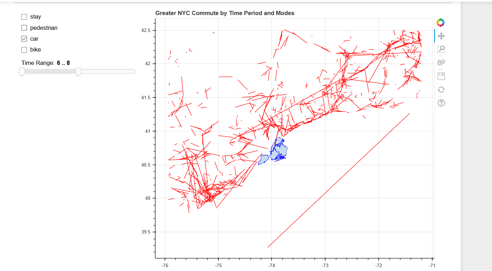
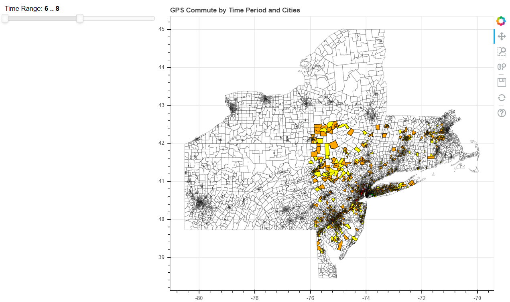
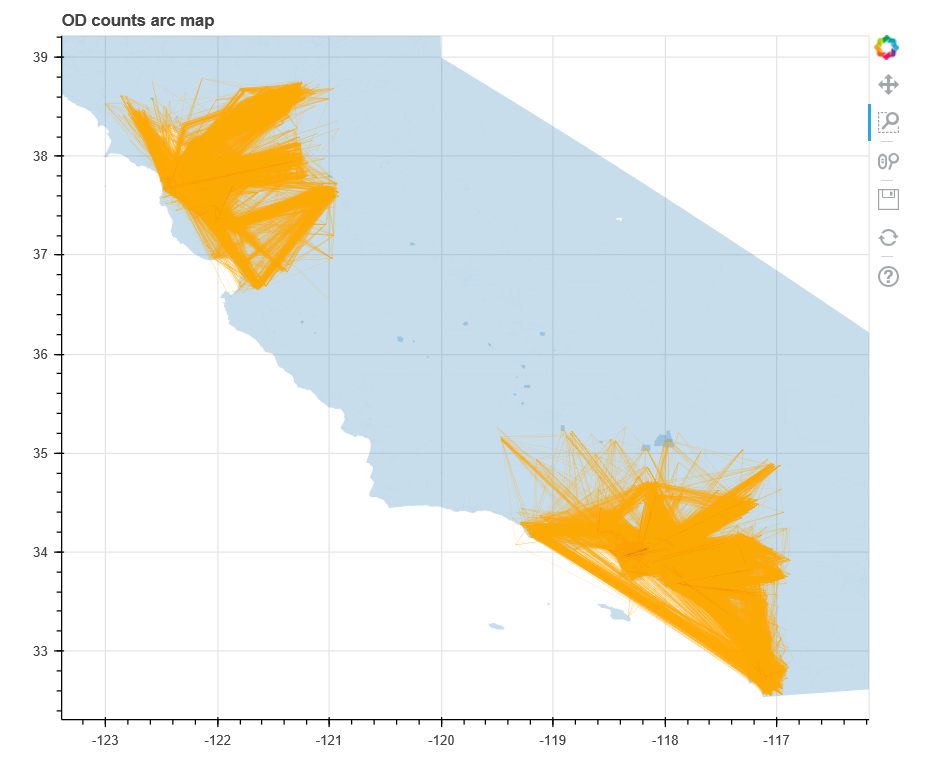
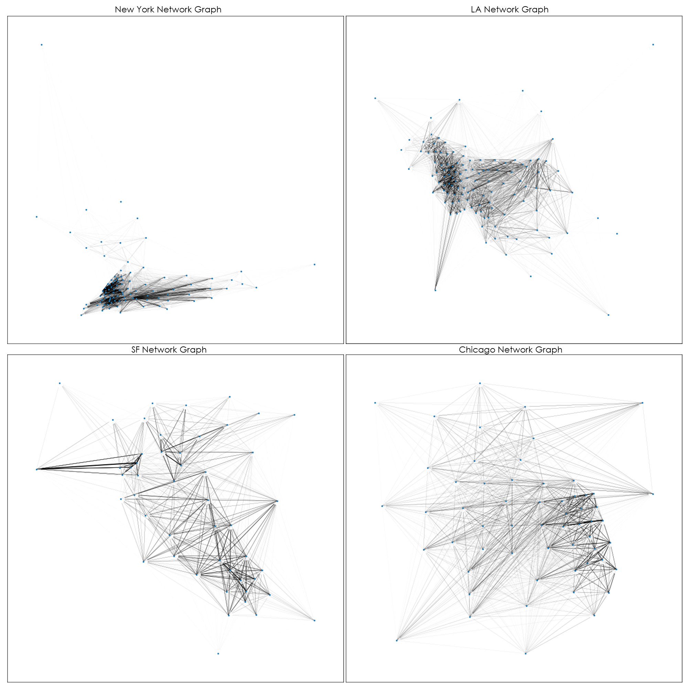

# Mobility-in-US-Cities
Project exploring the mobility patterns in Chicago, Los Angeles, New York City, and San Francisco. The work leverages GPS point data scraped from cellphone/device applications. The works focuses on pattern detection and comparison across cities, network topology of mobility networks through clustering, and node-edge volume/mode prediction using machine learning.

## Contributors and Authors:

- Colin Bradley
- Yuxuan Cui
- Abdullah Kurkcu 
- Jianwei Li
- Minqui Lu
- Kaan Ozbay
- Karan Saini

## Visualizations (D3, hosted):

- Interactive tools to visualize mobility patterns.
- Data is cleaned and filtered data and not the entire raw data.
- Data aggregated at different levels for various plots.
- Please refer to github link for details.

### 1) City + Time wise Individual CT level data:
  - https://karansaini282.github.io/mpi_d3/

### 2) City wise Origin-Dest Puma level data:
  - https://karansaini282.github.io/mpi_d3_2/

## Visualizations (Bokeh, local):

- Interactive tools for EDA to check data quality.
- Data is sponsor provided raw data.
- Data aggregated at CT level for all plots.
- Please refer to python notebooks with same name as plots for details.

### 1) Mode Time Map

### 2) Bokeh Heat Map

### 3) Bokeh Arc Map

## Visualizations (NetworkX, local):

- View of the Origin-Dest data in the form of a network.
- Nodes represent centroids of PUMA level geometry.
- Edge weights represent aggregated GPS pings.

